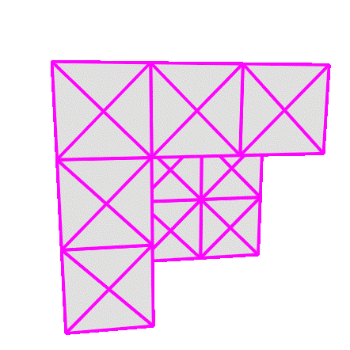

# object2-js

A small 3D graphics experiment written in plain JavaScript.  
No frameworks, no WebGL - just canvas and math.

Features:
* Interactive rotation and transition between normal and reverse perspective
* Lambertian diffuse lighting (based on surface normals and light direction)
* Hardcoded 3D object (the so-called “object2” - from an old Flash-era project)

Run the demo: [https://bntre.github.io/object2-js/](https://bntre.github.io/object2-js/)

